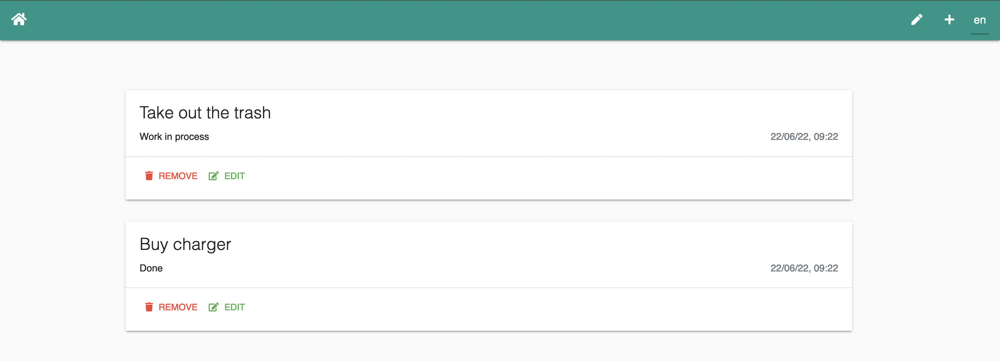
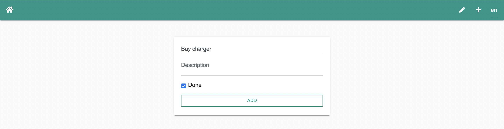
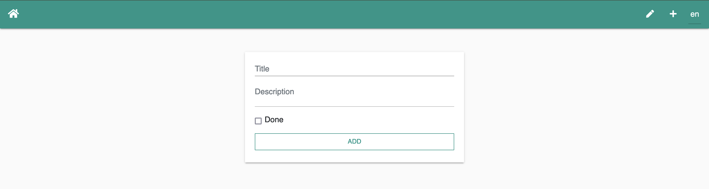

# Vue Todo App

> Another task management application. One of my first apps created with Vue.js 2.

## Preview

### Task view page



### Page to add tasks



### Page to edit tasks



## Project setup
```
npm install
```

### Compiles and hot-reloads for development
```
npm run serve
```

### Compiles and minifies for production
```
npm run build
```

### Run your tests
```
npm run test
```

### Lints and fixes files
```
npm run lint
```
